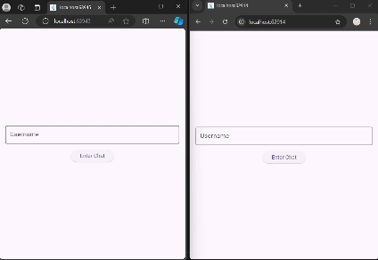

# Flutter Chat App Demo

This is a demo repo for the Medium article [Add Chatting to Flutter Apps with Socket.IO and Google Cloud Run](https://medium.com/@judydev/add-chatting-to-flutter-apps-with-socket-io-and-google-cloud-run-8895107aa9c0).

## Overview

This project demonstrates how to implement real-time chat functionality in a Flutter application using Socket.IO and deploy the backend server to Google Cloud Run.



Prerequisites:
- NodeJS
- Docker
- gcloud CLI (Alternative: use Google Cloud Console)
- Flutter SDK

## Getting Started

1. Clone this repository
2. Start the server (requires NodeJS)
```bash
cd socketio_server
npm install
node index.js
```  
3. Build and run a Docker container locally (requires Docker)
```bash
docker build -t <image_name>:<tag> .
docker run -d <image_name>
docker stop <container_ID>
docker restart <container_ID>
```
4. Build and push an image to Artifact Registry (requires gcloud CLI)
```bash
gcloud auth login
gcloud config set project <PROJECT_ID>
gcloud services enable artifactregistry.googleapis.com 

# Create a repository in Artifact Registry named REPO_NAME
gcloud artifacts repositories create <REPO_NAME> \
  --repository-format=docker \
  --location=<REGION> \ 
  --description="My Chat App Docker Repo"

# Update docker configuration to authenticate with Artifact Registry
gcloud auth configure-docker <REGION>-docker.pkg.dev

# Set a temporary variable for the location of the image to be pushed to
export TAGGED=<REGION>-docker.pkg.dev/<PROJECT_ID>/<REPO_NAME>/<IMAGE_NAME>:<TAG>

# Build a container with the tag
docker build -t $TAGGED .

# Push the tagged container to Artifact Registry
docker push $TAGGED

# Unset the variable
unset TAGGED
```
5. Deploy a Cloud Run service from the pushed image (requires gcloud CLI)
```bash
gcloud services enable run.googleapis.com

gcloud run deploy <SERVICE_NAME> \
  --image $TAGGED_IMAGE \
  --platform managed \
  --region <REGION> \
  --allow-unauthenticated
```
6. Run the Flutter app (requires Flutter SDK)
```bash
cd ../flutter_app_client
flutter pub get
flutter run # start an app on the connected device
flutter run -d chrome # start a web app in Chrome
flutter run -d edge # start a web app in Edge
```
To run the application on other devices, such as iOS or Android, additional setup may be required.
